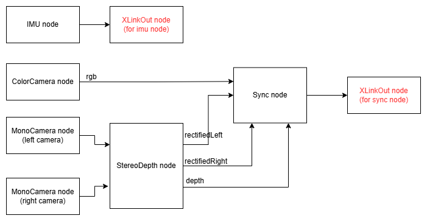

## Introduction
This project provides a C++ pipeline for streaming synchronized data from Luxonis OAK devices (OAK-D Lite), including:

- undistorted RGB image

    Resolution: 320×180, 30 FPS (synchronized)
- Stereo images (rectified left/right)

    Resolution: 640×480, 30 FPS (synchronized)
- Depth map (CV_16UC1, millimeters)

    Resolution: 640×480, 30 FPS (synchronized)
- IMU data

    6-DoF (accelerometer + gyroscope), 200 Hz

It ensures time-synchronized sensor output suitable for multi-sensor fusion pipelines.

## Docker setup
1. Building image
    ```shell=
    sudo docker build --network=host -t oak -f dockerFile .
    ```
2. Run Container
    ```shell=
    docker run -it --rm \
      --privileged \
      --net=host \
      --ipc=host \
      -e DISPLAY=$DISPLAY \
      -e XAUTHORITY=$XAUTHORITY \
      -v $XAUTHORITY:$XAUTHORITY \
      -v /tmp/.X11-unix:/tmp/.X11-unix \
      -v $(pwd):/workspace \
      -v /dev:/dev \
      oak
    ```
3. compile
    ```shell=
    ./build.sh
    ```
4. run inference
    ```shell=
    ./build/oak_stream
    ```

## OAK-D Lite Pipline
